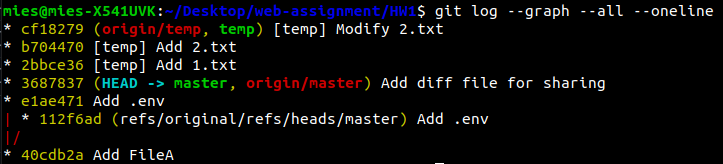
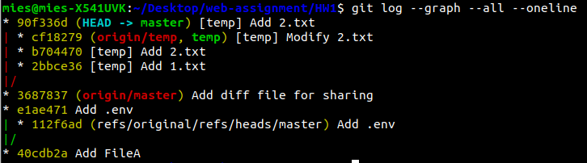
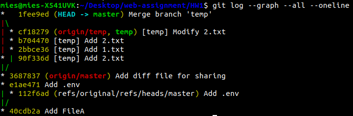

# Git Assignment

## Add Change To Last Commit

To add changes to the last commit I did the following:
```sh
git add . && git commit --amend
```

## Removing Sensitive Files Completely From Git History

To completely remove sensitive files like ```.env``` from git I did the following:
```sh
git filter-branch --index-filter "git rm -rf --cached --ignore-unmatch ./HW1/.env" HEAD
```
Since master branch is now one commit behind origin you need to push with ```--force``` option:
```sh
git push origin --force --all
```

## Share Files With Your Colleague Without Push

If you have ssh access its pretty straight forward:
```sh
git push computer2:projects/prog HEAD
git pull computer1:projects/prog HEAD
```
Otherwise you could save changes to a patch file:
```sh
git diff --cached > ./diff.patch
```
Send it to your colleague with email or flash drive and then apply it:
```sh
git apply ./diff.patch
```

## Cherry Pick

For last part I used cherry-pick instead of rebase. Here are some log history screenshots:

1- After adding 3 commits on temp branch:


2- After cherry-picking the second commit:


3- After merging all commits of temp into master:


